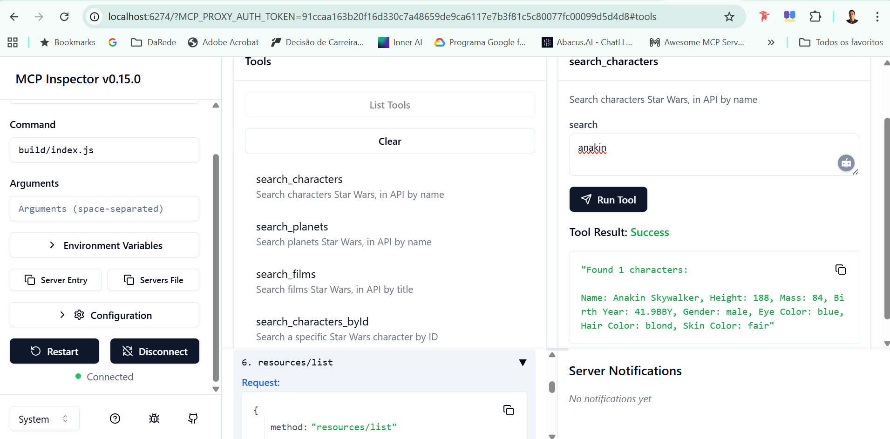

# Simple MCP Server - Star Wars API

## 📋 Sobre o Projeto

Este é um **micro projeto** para demonstração da criação de um **Model Context Protocol (MCP) Server** utilizando a API aberta [SWAPI (Star Wars API)](https://swapi.dev/) para fins de ilustração e portfólio.

O projeto demonstra como criar um servidor MCP funcional que pode ser integrado ao Claude Desktop ou testado através do MCP Inspector, fornecendo acesso a dados do universo Star Wars através de ferramentas e recursos estruturados.

## 🚀 Funcionalidades

### Tools Disponíveis
- **search_characters** - Busca personagens por nome
- **search_planets** - Busca planetas por nome
- **search_films** - Busca filmes por título
- **search_characters_byId** - Busca personagem específico por ID

### Resources Disponíveis
- **all_films** - Lista todos os filmes ordenados por episódio

## 🛠️ Tecnologias Utilizadas

- **TypeScript** - Linguagem principal
- **Node.js** - Runtime
- **Model Context Protocol (MCP) SDK** - Framework para criação do servidor
- **Axios** - Cliente HTTP para requisições à API
- **Zod** - Validação de esquemas
- **SWAPI API** - Fonte de dados (Star Wars)

## 📦 Instalação

### Pré-requisitos
- Node.js (versão 18 ou superior)
- npm ou yarn

### Passos para Instalação

1. **Clone o repositório:**
   ```bash
   git clone https://github.com/RamosJSouza/simple-mcp-server.git
   cd simple-mcp-server
   ```

2. **Instale as dependências:**
   ```bash
   npm install
   ```

3. **Compile o projeto:**
   ```bash
   npm run build
   ```

## 🎯 Como Usar

### Opção 1: MCP Inspector (Recomendado para Testes)

O MCP Inspector é uma ferramenta web que permite testar e interagir com servidores MCP de forma visual e intuitiva.

1. **Execute o inspector:**
   ```bash
   npm run inspector
   ```

2. **Acesse a interface:**
   - Abra seu navegador em: `http://localhost:6274`
   - Use o token fornecido no terminal para autenticação

3. **Teste as funcionalidades:**
   - Explore os tools disponíveis na aba "Tools"
   - Visualize os resources na aba "Resources"
   - Execute consultas e veja os resultados em tempo real

#### 🖼️ Interface do MCP Inspector



*Interface do MCP Inspector mostrando a busca por "anakin" e o resultado detalhado do personagem Anakin Skywalker com todas as informações (nome, altura, massa, ano de nascimento, gênero, cor dos olhos, cor do cabelo e cor da pele). A ferramenta permite testar todos os tools disponíveis de forma interativa.*

**Documentação oficial do MCP Inspector:** [Model Context Protocol Inspector](https://github.com/modelcontextprotocol/inspector)

### Opção 2: Claude Desktop

Para integrar com o Claude Desktop:

1. **Configure o arquivo de configuração:**
   ```json
   {
     "mcpServers": {
       "simple-mcp-server": {
         "command": "node",
         "args": ["C:\\caminho\\para\\seu\\projeto\\build\\index.js"],
         "env": {
           "NODE_ENV": "development"
         }
       }
     }
   }
   ```

2. **Localização do arquivo de configuração:**
   - **Windows:** `C:\Users\[SEU_USUARIO]\AppData\Roaming\Claude\claude_desktop_config.json`
   - **macOS:** `~/Library/Application Support/Claude/claude_desktop_config.json`

3. **Reinicie o Claude Desktop** para carregar a nova configuração

## 📚 Scripts Disponíveis

```bash
npm run build      # Compila o projeto TypeScript
npm run watch      # Compila em modo watch (desenvolvimento)
npm run inspector  # Executa o MCP Inspector para testes
```

## 🏗️ Estrutura do Projeto

```
simple-mcp-server/
├── src/
│   ├── index.ts          # Servidor MCP principal
│   └── types.ts          # Definições de tipos TypeScript
├── build/                # Código compilado (gerado)
├── package.json          # Configurações e dependências
├── tsconfig.json         # Configurações do TypeScript
└── README.md            # Este arquivo
```

## 🔧 Configuração e Personalização

### Adicionando Novos Tools

Para adicionar novos tools ao servidor:

1. **Defina o schema no arquivo `types.ts`**
2. **Implemente o tool no método `setupTools()`**
3. **Compile o projeto com `npm run build`**

### Exemplo de Tool

```typescript
this.server.registerTool(
    "nome_do_tool",
    {
        title: "Título do Tool",
        description: "Descrição do que o tool faz",
        inputSchema: {
            parametro: z.string().describe("Descrição do parâmetro"),
        },
    },
    async ({ parametro }) => {
        // Implementação do tool
        return {
            content: [
                {
                    type: "text" as const,
                    text: "Resultado do tool",
                }
            ]
        };
    }
);
```

## 🐛 Solução de Problemas

### Problemas Comuns

1. **Porta em uso no Inspector:**
   ```bash
   # Erro: "Proxy Server PORT IS IN USE at port 6277"
   # Solução: Aguarde alguns segundos e tente novamente
   ```

2. **Claude Desktop não detecta o MCP:**
   - Verifique se o caminho no arquivo de configuração está correto
   - Reinicie completamente o Claude Desktop
   - Verifique se o projeto foi compilado (`npm run build`)

3. **Erros de compilação:**
   - Execute `npm install` para garantir que todas as dependências estão instaladas
   - Verifique se está usando Node.js versão 18 ou superior

## 📖 Documentação Adicional

- [Model Context Protocol - Documentação Oficial](https://modelcontextprotocol.io/)
- [SWAPI - Star Wars API](https://swapi.dev/)
- [MCP Inspector - GitHub](https://github.com/modelcontextprotocol/inspector)

## 👨‍💻 Desenvolvedor

**RAMOS DE SOUZA JANONES**  
Desenvolvedor Full Stack  
LinkedIn: [linkedin.com/in/ramos-souza](https://linkedin.com/in/ramos-souza)  
GitHub: [github.com/RamosJSouza](https://github.com/RamosJSouza)

### Resumo Profissional
Desenvolvedor Full Stack com mais de 14 anos de experiência em arquiteturas escaláveis, microserviços e soluções cloud-native. Especialista em Node.js, React, Angular e DevOps, com histórico de liderança técnica e redução de 20% no tempo de entrega em projetos críticos. Focado em inovação, performance e mentoria de equipes ágeis.

### Habilidades Técnicas
- **Linguagens:** JavaScript, TypeScript, Python, PHP
- **Frontend:** React, React Native, Next.js, Angular, Redux, Styled Components, Storybook
- **Backend:** Node.js, NestJS, Express, GraphQL, REST
- **Bancos de Dados:** PostgreSQL, MongoDB, MySQL
- **Cloud & DevOps:** AWS, Serverless, GCP, Azure, Docker, Kubernetes, CI/CD (GitHub Actions, Azure DevOps)
- **Mensageria:** Kafka, RabbitMQ
- **Testes:** Cypress, Jest, TDD (Test-Driven Development)
- **Outras Ferramentas:** Power BI, Pentaho ETL
- **Desenvolvimento com IA:** Cursor AI, GitHub Copilot, Model Context Protocol (MCP), Prompt Engineering, Context Engineering, Desenvolvimento de Agentes de IA
- **Soft Skills:** Liderança técnica, mentoria, resolução de problemas, colaboração ágil

## ⚠️ Nota Importante

**Este projeto foi desenvolvido 100% manualmente, sem utilização de IA** para geração de código. Todo o desenvolvimento foi realizado através de conhecimento técnico próprio e experiência profissional, mesmo sendo um simples MCP Server.

## 📄 Licença

Este projeto é de código aberto e está disponível sob a licença MIT.

---

*Projeto criado para fins educacionais e demonstração de habilidades técnicas em desenvolvimento de servidores MCP.*
